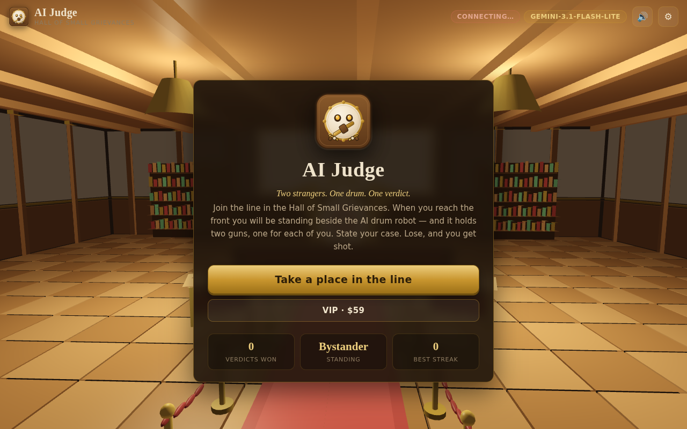
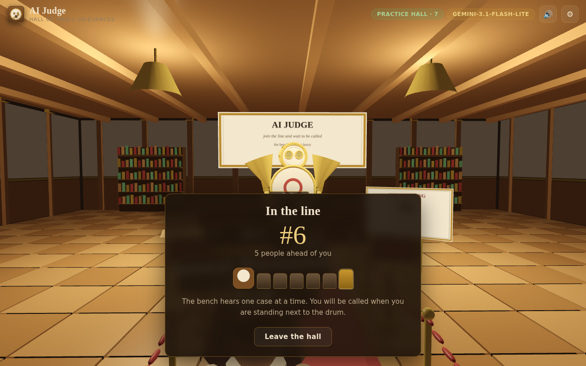
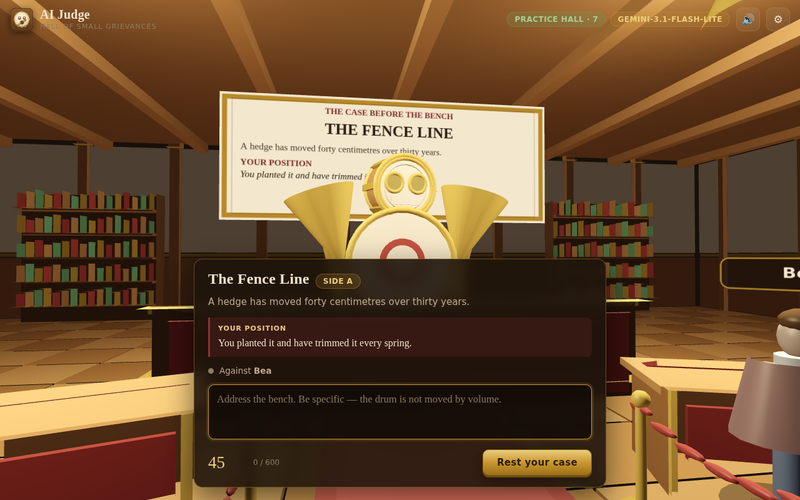
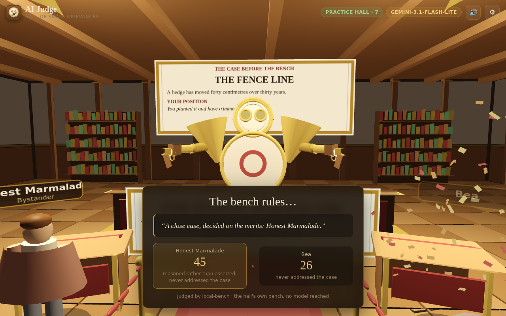

# AI Judge

Two strangers. One drum. One verdict.

You join the back of a line in the Hall of Small Grievances and shuffle forward
until you are standing next to the AI drum robot. It poses a case — a hedge that
moved forty centimetres, the last cinnamon bun, a dog called Biscuit — puts you
and a random opponent on opposite sides of it, and gives you both forty-five
seconds to make your case. Then it rules.

It holds two guns, one trained on each podium. The loser gets shot.



## The five builds

`make` puts all six in `dist/`. They are **not committed** — a build carries the
bench key (see below), so the artifacts stay out of the repository.

| File | Platform | Size |
|---|---|---|
| `AIJudge-1.0.0-vr.apk` | Meta Quest and other Android headsets | 133 KB |
| `AIJudge-1.0.0-android.apk` | Android 7 and later | 133 KB |
| `AIJudge-1.0.0-macos.dmg` | macOS 11 and later | 930 KB |
| `AIJudge-1.0.0-win-x64.exe` | Windows 10/11 x86-64 | 164 KB |
| `aijudge_1.0.0_amd64.deb` | Debian / Ubuntu x86-64 | 495 KB |
| `aijudge.html` | any browser, one file | 165 KB |

They are small because none of them bundles a browser engine. The game is
WebGL2 and WebXR; every platform already has an engine that runs it, so each
build ships a launcher that serves the game from `127.0.0.1` and opens it.

Serving over loopback rather than `file://` is deliberate. `http://127.0.0.1` is
a secure context and `file://` is not, and without a secure context there is no
`localStorage`, no `crypto.subtle` and — the one that matters — no WebXR.

### Android

```sh
adb install dist/AIJudge-1.0.0-android.apk
```

### VR

```sh
adb install dist/AIJudge-1.0.0-vr.apk
```

It installs as `com.aijudge.vr`, separate from the phone build, and declares
`com.oculus.intent.category.VR`, so it appears in the headset's VR library
rather than the 2D panel drawer.

**Read this part.** Android's `WebView` cannot start an `immersive-vr` session —
no WebView on any headset can. So the APK opens the hall on a large flat panel,
and carries a button, *Open in headset browser · full VR*, which hands the same
loopback URL to the headset's own browser. That browser **does** support WebXR,
and there the game is properly immersive: you stand in the hall at human scale,
the drum robot towers over the bench, and you point a controller at the argument
cards to speak. The app keeps serving the port while you are in the browser.

In immersive VR there is no DOM overlay, so everything you need to read or press
is a panel in the room: the case board above the bench, six argument stances
floating at your podium, and — during a drum morph — the two players' submissions
side by side, picked with the controller ray.

### macOS

Open the `.dmg`, drag **AI Judge** to Applications. It is **not code-signed or
notarised**, so the first launch needs Control-click → Open, or:

```sh
xattr -dr com.apple.quarantine /Applications/AIJudge.app
```

The bundle's launcher is a shell script. If `python3` is present it serves the
game on loopback; otherwise it falls back to opening the file directly, which
costs you `localStorage` persistence. Chrome, Edge, Brave or Chromium get an app
window; otherwise it opens in your default browser.

### Windows

Run `AIJudge-1.0.0-win-x64.exe`. Nothing to install and no DLLs to keep beside
it — it is statically linked. It opens Edge, Chrome or Brave in app-window mode
with its own profile directory, and quits when you close the window.

### Linux

```sh
sudo apt install ./dist/aijudge_1.0.0_amd64.deb
aijudge
```

Installs to `/opt/aijudge` with a launcher at `/usr/bin/aijudge` and a desktop
entry, so it also shows up in the applications menu. The binary is statically
linked, so it does not care how old the distribution's glibc is.

## How a case works



1. **The line.** You join the back of a queue of real people and advance one
   slot at a time. The bench hears one case at a time and you cannot be judged
   from anywhere but the front — the wait is the game's opening move, not a
   loading screen.
2. **The case.** At the front you are paired with whoever else is there. The
   robot poses one of 36 small disputes and assigns you a side. You get 45
   seconds. Saying nothing is a submission of nothing, and it loses.
3. **The deliberation.** The robot bows its head and plays a drum roll on its
   own torso while the model reads you both.
4. **The verdict.** Scores, a ruling read from the bench, and one line of
   feedback each.
5. **The shot.** Both arms come up, one gun per podium. The gun on the loser's
   side fires — a warm flash, a burst of brass confetti, and the loser goes over
   backwards. It is a cartoon, not a wound.



## The bench

| | Free | VIP |
|---|---|---|
| Model | `gemini-3.1-flash-lite` | `gemini-3.6-flash` |
| Drum morphs | — | 10 per day |

The two model ids live in one place, `MODELS` at the top of
[`web/src/judge.js`](web/src/judge.js). **Both were called for real against
Google's API during the build** and both answered the game's own request —
`generateContent` with the verdict `responseSchema` — with a parseable ruling.

`gemini-3.6-flash` reasons before it answers, and those thought tokens are
charged against `maxOutputTokens`: about 325 of them on a case like these. At a
512 budget the ruling came back truncated, so the larger model is given 2048 and
the Lite model 640. A `MAX_TOKENS` finish is caught explicitly and drops through
to the next route rather than surfacing as a parse error.

A verdict always arrives. The judge tries, in order: the game server's
`/api/judge` (its own key, kept server-side), then Gemini directly with the key
built into this release, then a local rule-based bench that reads for
specificity, reasoning and whether you engaged with your own side. The last one
is not a model and the game says so on the verdict card — it exists so the hall
never stalls.

### The bench key

`DEFAULT_API_KEY` in [`web/src/judge.js`](web/src/judge.js) is **empty in this
repository, on purpose.** `build/mkweb.py` substitutes the real key in when it
packages a release, reading it from `AIJUDGE_API_KEY` or `build/apikey.txt` —
neither of which is version-controlled. A plain checkout therefore builds a game
with no key, which falls back to the local bench and says so.

```sh
AIJUDGE_API_KEY=... make      # a release whose bench works out of the box
make                          # a keyless build; the local bench judges
```

`build/verify-packages.py` follows the same rule, so it asserts the key is in
every artifact when one is configured and asserts it is *absent* when one is not.

Two things worth being blunt about:

- **A key inside a client is not a secret.** Whoever has the APK, the `.exe` or
  the HTML can read it straight out of the file. Keeping it out of git only
  stops it being scraped by the bots that crawl public repositories; it does not
  make it private. Ship a key you are willing to have shared, with a quota cap.
- **The only key nobody can extract is a server-side one.** Run the game server
  with `GEMINI_API_KEY` set and point clients at it: `/api/judge` is tried first,
  the server's key wins, and it never leaves the machine.

### Drum morphs

A drum morph spends one of a VIP's ten daily charges and **makes you the drum**.
The camera moves up onto the bench and into the robot's head, both submissions
appear in front of you, and you rule. There is no appeal, the model does not get
a say, and the loser still gets shot. Charges reset at local midnight. If a
morphed player dithers for forty seconds, the bench takes the case back.

### VIP is $59

**No payment processor is wired into this build,** and I did not add one —
taking money needs an account you own, a real processor and a server you trust,
none of which I can stand up from here. What exists instead:

- With a game server running, `POST /api/vip/redeem` checks the code against
  `AIJUDGE_VIP_CODES`, marks it used, and records the grant against the player
  id. The client is never believed about its own VIP status; the server reads it
  from its own state file on every connection.
- With no server, any non-empty code unlocks VIP on that device only. That is
  for development and solo play, and the modal says so on screen.

Wiring a real checkout means one thing: mint a code after a successful payment
and put it in `AIJUDGE_VIP_CODES`. The rest already works.

## Multiplayer

```sh
node server/server.js
```

Zero dependencies — the WebSocket handshake and framing are implemented against
RFC 6455 in [`server/server.js`](server/server.js), so a bare Node install is
enough. It also serves the game itself, so `http://localhost:8787` is playable.

```sh
PORT=8787 \
GEMINI_API_KEY=... \
AIJUDGE_VIP_CODES=DRUM-0001,DRUM-0002 \
node server/server.js
```

Then put the address into the game's Settings. The server is authoritative about
the three things a client must not decide for itself: who is matched with whom,
whether a player really holds VIP, and what the verdict is.

With no server configured the game runs a **practice hall** — a simulated line of
strangers and a stand-in opponent — clearly labelled as such in the status bar.
It is how the game plays offline, on a plane, or before you have a server.



## The trailer

```sh
make trailer     # dist/AIJudge-1.0.0-trailer.mp4 — 3:00, 1920x1080, 30fps
```

The footage is the real game. `build/mktrailer.js` cancels the render loop and
drives `update()` / `render()` by hand a fixed 1/30s at a time, pulling each
frame straight off the canvas, so the capture is clean 1080p30 no matter how
slowly software WebGL draws — nine shots, about 160 seconds, with the camera
told where to stand. Nothing is mocked up: the queue really shuffles forward,
the drum roll is the animator, and the shot lands on the frame the game fires it.

`build/mktrailer.py` does the rest. It synthesises the score from scratch —
kick, toms, snare, cymbals, wood and a low drone, through a small convolution
hall, because the judge is a drum robot and the trailer should be carried by
drums — then draws the typography and the end card over the frames and encodes
the lot. No stock music, no stock footage, no editor.

## Building

```sh
make            # single file, icons, both APKs, deb, exe, dmg
make check      # play a full case in headless Chromium, then test the server
make serve      # open the hall on http://localhost:8787
```

| Script | Builds |
|---|---|
| `build/mkweb.py` | `dist/aijudge.html`, everything inlined |
| `build/mkicon.js` | PNGs, `icon.ico`, `icon.icns` from the one SVG |
| `build/mkandroid.py` | both APKs, driving aapt2/javac/d8/apksigner directly |
| `build/mkdesktop.py` | `.deb`, `.exe`, `.dmg` from `build/host.c` |
| `build/mktrailer.js` | captures the trailer's footage from the running game |
| `build/mktrailer.py` | synthesises the score, cuts the picture, encodes the mp4 |

Needs `python3`, `node` (playwright, for the icon rasteriser and the browser
tests), `cc`, `x86_64-w64-mingw32-gcc`, `dpkg-deb`, `genisoimage`, and an
Android SDK at `ANDROID_HOME` with platform 34 and build-tools 34.0.0.

The Android build makes every nested Java class `static`. That is not style
preference: d8 in build-tools 34.0.0 crashes dexing non-static inner classes
(`Cannot invoke "String.length()"`). The comment in `MainActivity.java` says so,
so nobody quietly reverts it.

## What was actually verified

`build/verify.js` drives real headless Chromium: it loads the hall, checks the
scene renders, then plays a case from the queue through the trial, the verdict,
the shot and the result screen. 21 checks, run against both `web/index.html` and
the single-file build, and **also against the URL served by the installed `.deb`**
— so the Linux package is proven to work end to end, not just to exist.

`build/verify-server.js` starts the server and walks two clients through the
line: matched at the front, opposite sides, the same case, one verdict delivered
to both, a wrong VIP code refused, a valid one accepted, the same code refused
twice, a drum morph handing the ruling to a player, and a walkout dismissing the
case. 21 checks.

`build/verify-packages.py` opens all five artifacts and checks format, payload
and metadata — PE headers, the ISO volume, manifest package ids, the VR launch
category, signatures, that the game inside each one is byte-identical to
`dist/aijudge.html`, and that the bench key is present or absent exactly as the
build was configured. 69 checks.

Both Gemini models were called against the live API during the build, with the
game's own request shape, and both returned a parseable ruling. With a key
configured, `verify-server.js` shows the whole chain working: two clients queued,
matched and handed one real `gemini-3.1-flash-lite` verdict.

**Not verified, and I will not claim otherwise:** the Windows `.exe`, the macOS
`.dmg` and both APKs were never executed. There is no Windows machine, no Mac and
no headset here. They are built from sources whose Linux twin was run and played,
and they are structurally sound, but "it runs" is not a claim I have earned for
those four. The immersive VR path in particular — the browser hand-off — is
implemented and reasoned about, not observed.

## Layout

```
web/            the game
  index.html    the shell
  style.css     the overlay
  src/
    gl.js       WebGL2: matrices, shader, mesh upload
    mesh.js     procedural geometry, one draw call per prop
    scene.js    the Judgment Hall, the drum robot, the guns, the avatars
    render.js   draw loop, in-world text panels, per-eye XR rendering
    xr.js       WebXR session, controller beams, ray-picking panels
    audio.js    every sound, synthesised — no audio files anywhere
    net.js      matchmaking client, and the offline practice hall
    judge.js    the scenes, the prompt, Gemini, and the local bench
    account.js  name, record, VIP, and the daily morph quota
    game.js     phases, animation, camera, the shot
    ui.js       the DOM overlay and boot
server/         the hall: matchmaking, VIP, the authoritative verdict
android/        one activity, two manifests
build/          build and verification scripts
dist/           the shipped artifacts
```

No frameworks, no libraries, no CDN, no build step for the game itself — the
renderer, the physics of the confetti, the drum synthesiser and the WebSocket
protocol are all in the tree.

## Licence and content

The hall is deliberately warm: oak, brass, parchment and deep red felt, lit by
two pendant lamps. Nothing in it glows blue.

The robot's guns are stylised brass sidearms with little drums for chambers, and
being shot means a flash, confetti and falling over backwards. There is no blood
and no gore, and the disputes are all about hedges, umbrellas and cinnamon buns.
