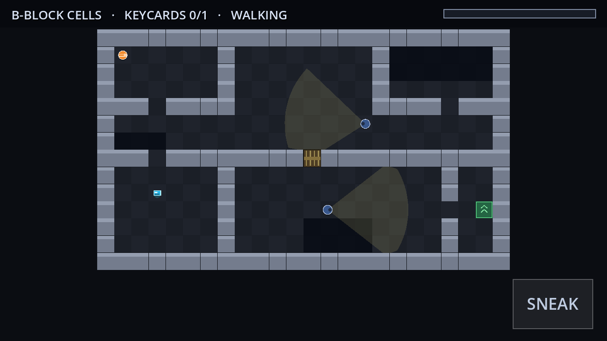

# Prison Break

A **3D** top-down stealth escape game built with **Godot 4.3**, packaged as an Android APK.

Three blocks stand between you and the outside. Each one needs every keycard on
the floor before the gate will open, and the guards are the only thing in your way.



## How to play

| | Touch | Keyboard |
|---|---|---|
| Move | Drag anywhere on the left of the screen (floating joystick) | `WASD` / arrow keys |
| Sneak | `SNEAK` pad, bottom-right (toggle) | Hold `Shift` |
| Restart level | — | `R` |
| Dismiss a message | Tap | `Space` |

**The rules**

- Collect every keycard on the level, then reach the green gate.
- Any keycard opens any locked door — just walk into one while holding one.
- Guards see in a cone. It turns **orange** when they suspect something and
  **red** once they have you. The bar in the top-right is how close you are to
  being caught; break line of sight and it drains back down.
- **Sneaking roughly halves the distance you can be spotted from**, at half speed.
- Dark floor patches halve it again. Standing still in one is the safest place
  on the map.
- Getting caught restarts the current block only.

## Levels

| # | Name | Guards | Keycards |
|---|------|--------|----------|
| 1 | B-Block Cells | 2 | 1 |
| 2 | The Yard | 3 | 2 |
| 3 | Perimeter Wall | 4 | 2 |

## Project layout

```
game/
├── project.godot            # engine + input map config
├── export_presets.cfg       # Android export preset
├── assets/                  # icon sources (SVG) and rendered PNGs
├── src/
│   ├── main.gd              # level/mesh building, A* grid, game state machine
│   ├── main.tscn            # entry scene (everything else is built in code)
│   ├── levels.gd            # the level grids and patrol routes
│   ├── player.gd            # CharacterBody3D movement + visibility model
│   ├── guard.gd             # patrol / suspect / chase AI, vision cone meshes
│   ├── hud.gd               # status bar, overlays, touch controls
│   ├── keycard.gd           # spinning pickup
│   └── exit_gate.gd         # pulsing exit pillar
└── tools/
    ├── smoke_test.gd        # headless correctness checks
    └── screenshot.gd        # renders each level to a PNG
```

Levels are plain character grids in `src/levels.gd` — `#` wall, `.` floor,
`P` start, `K` keycard, `D` door, `E` exit, `~` shadow. Everything is generated
from that grid at load time: the wall meshes (one MultiMesh, so hundreds of
blocks cost a single draw call), one StaticBody3D holding every wall collider,
and an AStarGrid2D laid on the X/Z plane for guard navigation. A new level is
just a new block of text plus patrol waypoints.

## Notes on the 3D

- One grid cell is 2.0 world units; walls are 2.6 units tall.
- The camera is a fixed-orientation follow cam. It never rotates, so a given
  stick direction always means the same world direction — the only scheme that
  stays workable one-thumbed.
- Guard sight lines are cast at eye height (1.15) so a guard cannot see over a
  wall, and each vision cone is rebuilt every physics tick from one raycast per
  edge, which is what makes it visibly stop at corners.
- Rendering targets the `gl_compatibility` backend for mobile.

## Building

Requires Godot 4.3 with export templates, plus the Android SDK
(build-tools 34, platform 34) for the APK.

```bash
# Run the correctness checks
godot --headless --path game --script res://tools/smoke_test.gd

# Regenerate the level screenshots
xvfb-run godot --path game --rendering-driver opengl3 \
    --script res://tools/screenshot.gd

# Build the APK (keystore is passed via env, never committed)
export GODOT_ANDROID_KEYSTORE_RELEASE_PATH=/path/to/release.keystore
export GODOT_ANDROID_KEYSTORE_RELEASE_USER=youralias
export GODOT_ANDROID_KEYSTORE_RELEASE_PASSWORD=yourpassword
godot --headless --path game --export-release "Android" build/PrisonBreak.apk
```

The smoke test is the one worth keeping in the loop: besides checking the grids
are well formed, it verifies each level is actually **winnable** — that a keycard
is reachable before any door is opened, that every keycard and the exit are
reachable once doors are open, and that no patrol route is cut in half by a door
a guard cannot open. It caught three unwinnable levels during development.

## The build in this repo

Two release builds, both minSdk 21 (Android 5.0+), signed with a debug key:

| File | Size | ABIs |
|---|---|---|
| `build/PrisonBreak.apk` | 44 MB | `arm64-v8a` + `armeabi-v7a` |
| `build/PrisonBreak-arm64.apk` | 23 MB | `arm64-v8a` only |

The arm64-only build covers every phone from roughly 2015 onward; take the
dual-ABI one only if you need a 32-bit device. Build them with the `Android`
and `Android arm64` presets respectively.

Because it is signed with a debug key rather than a Play-issued one, Android
will warn about installing from an unknown source; allow it for your browser or
file manager to install. Replace the keystore with your own before distributing.
