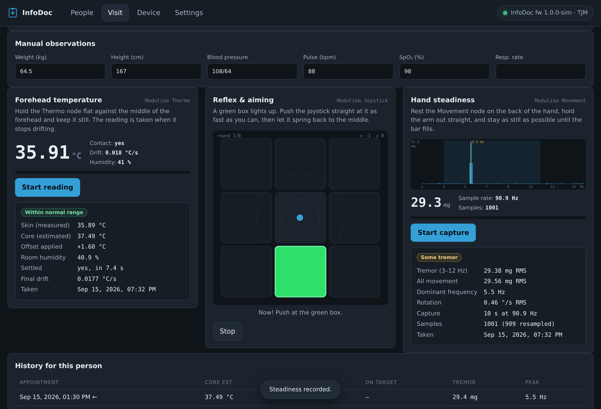

# InfoDoc

A desktop app for the notes you keep on people coming in to see a doctor —
and for three quick checks taken with an Arduino and three Modulino nodes:

| Check | Node | What it measures |
|---|---|---|
| Forehead temperature | Modulino Thermo | contact skin temperature, read once it settles |
| Reflex & aiming | Modulino Joystick | a green box lights up, you push the stick at it |
| Hand steadiness | Modulino Movement | how much the hand shakes, and at what frequency |

Everything runs on your own machine. There is no account, no server and no
network traffic beyond the link to the board.



> **InfoDoc is not a medical device.** Nothing here is certified and nothing
> here diagnoses anything. The three checks are rough screening aids for a
> clinician who is already in the room. See [Honest limits](#honest-limits).

## Builds

| File | Platform | Size |
|---|---|---|
| `infodoc_1.0.0_amd64.deb` | Debian / Ubuntu x86-64 | 90 MB |
| `infodoc-1.0.0-win32-x64.tar.xz` | Windows 10+ x86-64 | 85 MB |
| `infodoc-1.0.0-macos-arm64.tar.xz` | macOS, Apple Silicon | 72 MB |
| `infodoc-1.0.0.html` | any browser | 115 KB |

All four are the same app and all four work offline.

### Linux

```sh
sudo apt install ./infodoc_1.0.0_amd64.deb
infodoc
```

Installs to `/opt/infodoc` with a launcher at `/usr/bin/infodoc` and a desktop
entry, so it also shows up in the applications menu. Use `apt` rather than
`dpkg -i` so the dependencies come along; with `dpkg -i`, follow up with
`sudo apt-get install -f`.

To reach a USB serial port your user needs to be in the right group — `dialout`
on Debian and Ubuntu:

```sh
sudo usermod -aG dialout "$USER"     # then log out and back in
```

### Windows

```
tar -xf infodoc-1.0.0-win32-x64.tar.xz
```

Then run `InfoDoc.exe` from the extracted folder. `tar` is built into Windows 10
and later, and File Explorer on Windows 11 opens `.tar.xz` directly. Keep the
folder together — `InfoDoc.exe` needs the DLLs and `resources/` next to it.

The build is **not code-signed**, so SmartScreen will warn on first run
(More info → Run anyway).

### macOS

```sh
tar -xf infodoc-1.0.0-macos-arm64.tar.xz
xattr -dr com.apple.quarantine InfoDoc.app
open InfoDoc.app
```

Also **not signed or notarised**, so Gatekeeper refuses it until the quarantine
flag is cleared as above; right-click → Open works too. This build is Apple
Silicon only — an Intel Mac needs the `darwin-x64` runtime instead, which
`src/mkdesktop.py` can build.

### The single HTML file

`infodoc-1.0.0.html` is the whole app in one file. Open it in any browser, even
off a USB stick. Two differences from the desktop builds:

* records go to that browser's local storage for the origin the file came from,
  so clearing site data erases them — export a copy;
* Web Serial is only in Chromium-family browsers, and never in Safari or
  Firefox. Use the network transport there, or the desktop app.

## Hardware

An **Arduino UNO Q (4 GB or larger)**, a **Modulino Thermo**, a **Modulino
Joystick** and a **Modulino Movement**. The nodes chain onto the same Qwiic bus
in any order — no jumpers, no soldering. An UNO R4, Nano ESP32, MKR or Nano 33
works too, and is simpler to connect (see below).

Flash `firmware/infodoc_mcu/infodoc_mcu.ino`; the details, the wiring and the
troubleshooting are in [`firmware/README.md`](firmware/README.md).

### Two ways to reach the board

InfoDoc's **Device** tab offers both. They carry an identical protocol, so
everything downstream behaves the same.

**USB serial** — the app opens a serial port directly through Web Serial. Use
this for any board whose sketch `Serial` *is* its USB port: UNO R4, Nano ESP32,
MKR, Nano 33.

**Network** — the app connects to `ws://<board>:8787`.

The UNO Q usually needs the network route, and it is worth knowing why. The
UNO Q has two brains: sketches run on the STM32U585 MCU, while the USB-C socket
belongs to the Qualcomm Dragonwing MPU running Debian. So plugging the UNO Q
into a computer does **not**, by default, present the sketch's `Serial` as a
port the computer can open — the host talks to the board's Linux side. Run
[`firmware/uno_q_bridge/bridge.py`](firmware/uno_q_bridge/README.md) there and
it relays the MCU's lines over a WebSocket, which InfoDoc connects to. The
bridge needs no pip installs.

If your UNO Q *is* configured with a USB CDC gadget on the Linux side, the USB
serial transport works directly and you can skip the bridge.

## Using it

**People** — the roster. Search by name, clinic ID, phone or date of birth. A
record holds identity, contact, next of kin, allergies, medication, ongoing
conditions, free notes, and a list of appointments. Age is computed from the
date of birth, and for a past appointment, from the date of that appointment.

**Visit** — one appointment. Reason, clinician, department, status, notes,
manual observations (weight, height, BP, pulse, SpO₂, respiratory rate), then
the three instrumented checks and a history table of every previous set of
readings for that person. **Print summary** produces a one-page sheet.

**Device** — connect, see which nodes answered, watch the raw traffic, and send
protocol lines by hand. Useful when something is not working.

**Settings** — the clinic name, every threshold the three checks use, and
export / import / erase.

Ctrl/Cmd+1…4 switch views. Escape stops a running check.

## What the three checks actually do

### Forehead temperature

The Modulino Thermo is an HS3003: a **contact** temperature and humidity sensor,
not an infrared thermometer. There is no way to point it at someone from across
the room. So InfoDoc treats it as what it is — you hold the node flat against
the middle of the forehead, and the app waits for the reading to stop climbing:

* contact is assumed once the reading passes **30 °C** (configurable);
* a least-squares gradient over a rolling 3-second window gives the drift;
* the reading is taken when that drift falls below **0.02 °C/s** and the window
  spans less than 0.2 °C, and the value recorded is the mean of the last eight
  samples rather than one;
* if it never settles, the app says so instead of quietly recording a number
  that was still moving.

Skin is cooler than core, so a fixed **skin → core offset** (default +1.6 °C) is
added to produce the estimate. The raw skin value, the offset used, the settle
time and the final drift are all stored, so a reading can be re-interpreted
later if you change the offset. See [Calibration](#calibration).

### Reflex & aiming

A green box lights in one of the eight cells around the middle of a 3×3 grid,
after a random 0.7–2.2 s wait. Push the stick at it, then let it spring back.
Per round, InfoDoc records:

* **reaction time** — from the box lighting to the stick leaving the dead zone;
* **direction error** — the angle between where you pushed and where the box
  was, taken where the push passes the commit threshold. Within 22.5° counts as
  a hit, since eight directions are 45° apart;
* **settle time** — how long until the aim is held on target for 150 ms;
* **false starts** — moving before the box lights, or within 100 ms of it,
  which is a guess rather than a reaction. A false start is replayed.

Eight rounds by default. The summary is the median reaction time (not the mean —
one distraction should not move it), the fastest round, the spread, hits out of
rounds, wrong directions, misses, and the mean aim error.

**On timing.** The board timestamps every sample with its own `millis()` at the
moment the sensor was read, and the app estimates the offset between that clock
and its own with repeated `PING`/`PONG`, keeping the sample with the lowest
round trip. Reaction times are then computed entirely in board time, so USB
scheduling jitter does not land in the measurement. The round trip actually
achieved is stored with each result, so you can see how good the timing was.

### Hand steadiness

Rest the Movement node on the back of the hand, hold the arm out straight, stay
still for ten seconds. The accelerometer is sampled at 100 Hz, then:

* samples are resampled onto an even grid at the measured rate (timestamps are
  never assumed regular);
* the magnitude of the acceleration vector is taken, which drops the dependence
  on how the node happens to be oriented;
* mean **and linear trend** are removed, so slow postural sag does not count as
  tremor;
* a Hann window and a DFT give the spectrum, and Parseval's relation with the
  window's power correction turns the power in the **3–12 Hz** band back into an
  honest RMS in milli-g;
* the dominant frequency is the largest bin between 1 and 16 Hz.

Reported: tremor amplitude in the band, total movement, dominant frequency, and
gyroscope RMS in °/s. The spectrum is plotted with the band shaded and the peak
marked.

The verification suite injects a known 30 mg peak sinusoid at 6 Hz and checks
the app recovers 21.2 mg RMS (30/√2) at 6.0 Hz. It does, to within 1%.

### The words on the results

Each check prints a short band — "Within normal range", "Brisk", "Some tremor".
**These bands are this app's own thresholds, not clinical criteria**, and they
exist so a row in the history table is skimmable. The numbers are what matter;
the thresholds are all visible and editable in Settings.

## Calibration

The temperature offset is the one number you should not leave at its default.
It depends on your particular node, on where on the forehead you hold it, and
on how hard you press.

Measure it: on several well people, take an InfoDoc reading and a clinical
thermometer reading back to back, and average `clinical − skin`. Put that in
Settings → Thermo → *Skin → core offset*. Because the raw skin value is stored
on every record, changing the offset later does not invalidate old readings —
you can recompute them.

The other thresholds rarely need touching. The joystick dead zone (30 of 127)
and commit threshold (70 of 127) are worth raising if a patient's resting hand
tremor is itself tripping the dead zone and producing false starts.

## Where the records live

The desktop builds keep everything in one JSON file in the OS application-data
directory — Help → *Where are my records?* shows the exact path:

| Platform | Path |
|---|---|
| Linux | `~/.config/infodoc/infodoc-records.json` |
| Windows | `%APPDATA%\InfoDoc\infodoc-records.json` |
| macOS | `~/Library/Application Support/InfoDoc/infodoc-records.json` |

Writes go to a temp file and are renamed over the target, with the previous
version kept as `.bak`, so a crash mid-write cannot corrupt the file. Saves are
coalesced, so typing does not hammer the disk.

The format is plain JSON with a version field, and `Export records…` writes the
same document indented. Import either replaces everything or merges, keeping
whichever copy of each record has the newer `updated` stamp.

## Honest limits

* **InfoDoc is not a medical device.** It is not certified by anyone, for
  anything. Do not use it in place of proper equipment, and do not make a
  clinical decision on the strength of a number it produced.
* **The temperature is a contact skin reading with a fixed offset**, not a
  thermometer measurement. It is affected by sweat, draughts, how hard the node
  is pressed and how long it was held. A febrile patient can read normal.
* **The reflex and steadiness figures have no diagnostic meaning on their own.**
  They are sensitive to practice, motivation, caffeine, how the node is held and
  whether the patient understood the instruction. They are most useful as a
  trend for one person over several appointments, which is why the history table
  exists.
* **Records are stored unencrypted** on the machine. Anyone with access to the
  account can read them. Use full-disk encryption and a locked account, keep
  backups, and follow whatever your jurisdiction requires for patient data.
  InfoDoc has no access control of its own.
* **The bridge has no authentication.** Anything that can reach port 8787 can
  read the sensor stream. No patient data crosses that link, but bind it to
  localhost or firewall it on a clinic network.

## Developing

```sh
python3 src/mkhtml.py        # build the single-file HTML from app/
python3 src/simulator.py     # a fake board, so no hardware is needed
node    src/verify.js        # the end-to-end test suite
node    src/screenshots.js   # regenerate docs/
```

The app is plain ES5-compatible JavaScript in five files with no build step and
no dependencies: `store.js` (records and persistence), `link.js` (transports and
protocol), `tests.js` (the three measurement engines, no DOM), `ui.js` (views,
canvases, printing) and `app.js` (boot). Editing `app/` and reloading is the
whole development loop; `mkhtml.py` only inlines.

### The simulator

`src/simulator.py` speaks the firmware's protocol over the same WebSocket the
bridge serves, so you can develop and demonstrate with no board attached. Point
the Device tab at `ws://127.0.0.1:8787`.

```sh
python3 src/simulator.py --skin 38.9          # a febrile patient
python3 src/simulator.py --tremor-hz 5 --tremor-mg 60
python3 src/simulator.py --no-thermo          # a missing node
```

It also takes two commands the real firmware refuses, `SIMAIM <deg> [ms]` and
`SIMCENTER`, which is how the test suite plays the reflex test.

### Building the desktop packages

```sh
python3 src/mkdesktop.py     # downloads Electron, builds the .deb and the trees
python3 src/repack.py        # trims locales, compresses win/mac as .tar.xz
```

`src/icons.py` draws the icon and writes PNG, ICNS and ICO with no image
library — there is no Pillow in the build environment, so it rasterises by hand.

### Why .tar.xz for Windows and macOS

The Electron binary alone is 215 MB on Windows. Zipped, the bundle lands past
GitHub's 100 MB per-file limit; xz gets it to 85 MB. `tar` also preserves the
symlinks a macOS `.app` framework needs, which zip handles poorly. 96 MB of
unused Chromium locales are dropped as well — the builds keep `en-US` only.

## What was verified

`node src/verify.js` drives the real build in headless Chromium against the
simulator, and `node src/verify.js --electron <binary>` drives the installed
desktop app. **51 checks, all passing** in Electron; 47 in the browser, which
has no file-backed store to check:

* the app loads with no page errors, and none appear during the whole run;
* the WebSocket transport connects, `HELLO`/`STAT` parse, all three nodes are
  reported, and the clock offset converges;
* **temperature**: the settle logic recovers the simulated 34.80 °C forehead to
  within 0.01 °C, marks the reading settled after 8.2 s, and applies the offset;
* **steadiness**: an injected 30 mg sinusoid at 6 Hz comes back as 20.9 mg RMS
  (21.2 expected) with the peak at exactly 6.0 Hz, from 1001 samples;
* **reflex**: eight rounds run, the simulated hand hits 8 of 8 with a 0.3° mean
  aim error, and the median reaction time of 291 ms sits where a 240 ms
  simulated delay plus the stick's travel should put it;
* no stream is left running and no test handler leaks after a test finishes;
* a link lost mid-capture abandons the test and records nothing partial, and the
  streams flow again after reconnecting — including when a stream claim was
  still held as the link died, which is the case that wedges quietly. That check
  was confirmed to fail (0 samples) against a deliberately broken build;
* records, notes, observations and all three measurement sets survive a restart,
  through localStorage in the browser and through the JSON file in Electron —
  the file is then read back off disk and checked;
* the printed visit summary contains the patient, all three measurements, the
  measured numbers and the not-a-medical-device note;
* search by clinic ID, the empty-search message, and disconnecting the device
  disabling every check.

The bridge has its own test: a real WebSocket handshake with accept-key
verification, split lines reassembled, extended-length frames, host commands
reaching the tty, ping/pong, and 300 rapid samples relayed in order with none
lost.

The **`.deb` was installed and launched on a real Debian-family system** under
`xvfb`, and the whole suite above was then run against that installed binary —
`navigator.serial` present, the preload store active, every app global live, and
the records file written, read back and checked on disk. `chrome-sandbox` ships
setuid root as Electron requires.

The **Windows and macOS archives were checked structurally only**:
`InfoDoc.exe` is a valid PE32+ x86-64 image, `InfoDoc.app`'s executable is a
64-bit arm64 Mach-O with its exec bit and all 14 framework symlinks intact, and
`Info.plist` points at the right executable and icon. **Neither was actually
run** — there is no Windows or macOS machine in the build environment. They are
assembled from official Electron runtimes with the same payload and `main.js`
that were verified on Linux, but "runs on Windows" is not a claim that has been
tested.

Nothing has been tested against real Modulino hardware, because there is none
here. The firmware is written against the published Modulino API
(`getTemperature`/`getHumidity`, `getX`/`getY`/`isPressed`,
`getX`/`getY`/`getZ` and `getRoll`/`getPitch`/`getYaw`) and it compiles as
straightforward Arduino C++, but it has not been on a board.

## Checksums (SHA-256)

```
d5ae54d44d9c2a8d28a55994e3fb1cb53079f690576a46350a47d237e92f948a  infodoc-1.0.0.html
d43a5c45d99536a5b268f637860af6dbc2880eaea481abd22a59a83d7aefd763  infodoc_1.0.0_amd64.deb
b77da063bd9aa8c5d51c57042d8445f886c0c45127dd804ca8efe0caf1b0832c  infodoc-1.0.0-win32-x64.tar.xz
861bd0173c131347574c697a516020fc06d3138a5b509d78dc1db1255d5daeb3  infodoc-1.0.0-macos-arm64.tar.xz
```
