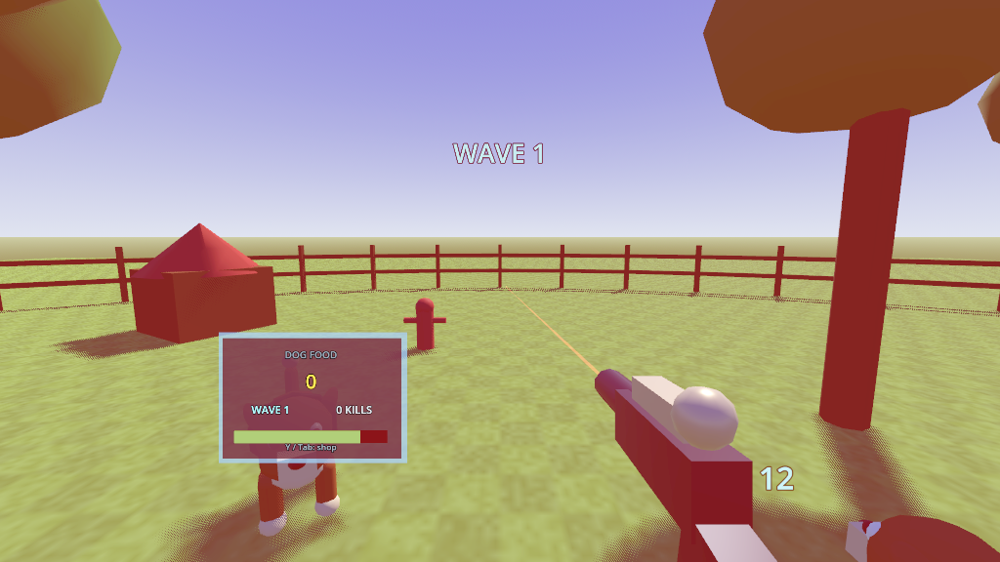
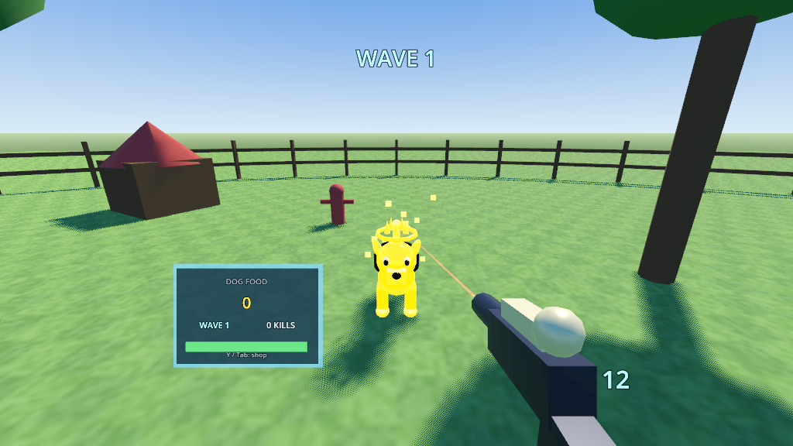
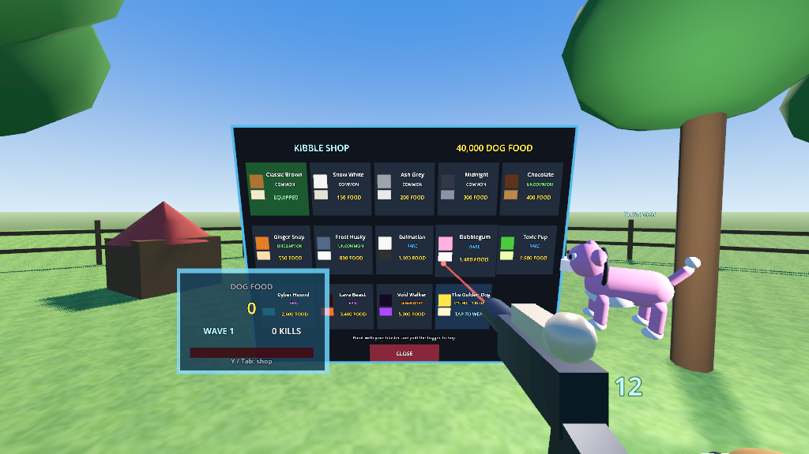

# Dog Blaster VR

A standalone Meta Quest game built with Godot 4.4 and OpenXR. Cartoon dogs
charge you in waves, every kill drops **Dog Food**, and Dog Food buys coats for
your own dog — including the ultra rare **Golden Dog**.

Runs natively on Quest 3, Quest 3S, Quest 2 and Quest Pro. The prebuilt APK is
in [`build/DogBlasterVR.apk`](build/DogBlasterVR.apk) (29 MB, arm64, signed).



## Install it on a headset

1. Enable Developer Mode for your headset in the Meta Horizon phone app, then
   plug the headset into your computer and accept the USB debugging prompt.
2. `adb install -r build/DogBlasterVR.apk`
3. In the headset open **Library → Unknown Sources → Dog Blaster VR**.

SideQuest works too — drag the APK onto its "Install APK from folder" button.

## How to play

| Action | Quest controls | Desktop fallback |
| --- | --- | --- |
| Shoot | Right trigger | Left mouse button |
| Move | Left thumbstick | `W` `A` `S` `D` |
| Snap turn | Right thumbstick | Mouse look |
| Open the shop | `Y` or `B` (or the menu button) | `Tab` |
| Reload | `X`, or fire the magazine dry | `R` |
| Release the mouse | — | `Esc` |

A laser sight runs out of the blaster's muzzle. It is also the shop pointer:
open the shop, put the dot on a tile, pull the trigger.

Waves scale up in size, speed and toughness. Dogs bite when they reach you;
you regenerate after four quiet seconds. If they take you down you respawn one
wave back and keep everything you earned.

### Earning Dog Food

| Source | Payout |
| --- | --- |
| Ordinary kill | 8 + 1.5 per wave, dropped as kibble that flies to you |
| Headshot | Double, and double damage |
| Clearing a wave | 25 + 15 per wave |
| Killing a Golden Dog | 500, plus the cosmetic itself |

### The Golden Dog



The Golden Dog is the rarest thing in the game — solid gold, self-lit, wearing
a crown, trailing sparkles. There are three ways to get it:

- **Kill one.** Roughly 1.2% of spawns from wave 2 onward is a live Golden Dog:
  bigger, slower, far tougher, and worth 500 Dog Food. Killing it grants the
  cosmetic outright.
- **Get lucky.** Any ordinary kill has a 1-in-1000 chance of dropping it.
- **Buy it.** 25,000 Dog Food in the shop, for anyone who would rather grind.

### The Kibble Shop



Fourteen coats for your dog, from Classic Brown (free) up through Dalmatian,
Cyber Hound, Lava Beast and Void Walker to The Golden Dog. Buying one equips it
immediately; your dog trots ahead and to your left so you can always see what
you paid for, and the blaster's trim is tinted to match.

Your balance, purchases, equipped skin and records persist in
`user://dogblaster.save` between sessions.

## Building it yourself

Requirements:

- Godot **4.4.1** (standard build) plus its export templates
- Android SDK with `platform-tools`, `build-tools;34.0.0`, `platforms;android-34`
- **JDK 17** — the Gradle 8.2 that ships in Godot's Android template cannot run
  on JDK 21

```bash
GODOT=/path/to/godot \
ANDROID_SDK_ROOT=/path/to/android-sdk \
JAVA_17_HOME=/usr/lib/jvm/java-17-openjdk-amd64 \
tools/build_apk.sh
```

The script installs Godot's Android Gradle template into `android/build/`,
writes the editor settings the headless export needs, creates a self-signed
release keystore at `android/release.keystore` if there isn't one, exports, and
verifies the signature. `--debug` builds a debug-signed APK instead.

The build ends by asserting that the APK really contains `libopenxr_loader.so`
and the immersive-HMD intent category. That check exists because of a nasty
failure mode: the OpenXR vendors extension crashes while the headless editor
tears down, Godot notices the crash and starts the *next* run in recovery mode,
recovery mode disables all addons — and the export then quietly produces an APK
that installs fine and never enters VR. The script clears the recovery lock
before every invocation and keeps `android/build` out of the asset scanner
(Gradle's output tree contains a second copy of the addon, which is what
triggers the crash in the first place).

**Keep `android/release.keystore`.** It is deliberately not committed, and
Android only lets you upgrade an installed app with the key that first signed
it. Losing it means uninstalling before you can install a new build.

### Running the tests

```bash
GODOT=/path/to/godot tools/run_tests.sh
```

Boots the real game headlessly and drives it: spawning, the kill → Dog Food →
shop economy, buying and equipping, both Golden Dog unlock paths, the blaster,
player damage, and the save round-trip. 30 checks.

### Screenshots

```bash
xvfb-run -s "-screen 0 1600x900x24" godot --path . tools/screenshot.tscn
```

Poses the camera at a few angles and writes PNGs to `user://`.

### Regenerating generated files

```bash
python3 tools/make_icons.py                              # icon.png + android/icon_*.png
godot --headless --path . --script res://tools/gen_action_map.gd   # openxr_action_map.tres
```

## How it is put together

```
project.godot            Mobile renderer, OpenXR on, foveation, 72 Hz physics
scenes/main.tscn         One node; everything else is built in code
scripts/
  game.gd                Boot, world, player rig, waves, damage, announcements
  skins.gd               The 14-skin catalogue (autoload `Skins`)
  save_manager.gd        Dog Food, inventory, records (autoload `SaveGame`)
  dog_factory.gd         Procedural dog meshes and materials (autoload `DogFactory`)
  sfx.gd                 Synthesised sound effects (autoload `Sfx`)
  dog.gd                 Enemy AI, damage, death
  companion.gd           Your dog
  gun.gd                 The Kibble Blaster and its laser sight
  shop.gd                The Kibble Shop panel
  hud.gd                 Wrist readout
  pickup.gd              Dropped kibble
addons/godotopenxrvendors/   GodotVR OpenXR vendors plugin 4.2.2 (Meta loader)
```

There are no imported art assets. Every dog, prop, sound and texture is
generated at runtime from primitives and PCM buffers, which is why the APK is
29 MB and most of that is the Godot engine itself.

Two details worth knowing if you extend it:

- **Dogs are one mesh.** Each skin's ~20 body parts are merged with
  `SurfaceTool` into a single `ArrayMesh` with four surfaces, cached per skin.
  A dog costs four draw calls instead of twenty, which is what makes a pack of
  eleven of them viable at 72 Hz. Animation is therefore whole-body: a hop,
  squash and lean rather than per-limb rigging.
- **UI panels are opaque on purpose.** Alpha-blended quads sort by distance to
  the camera, which drew the shop's backdrop over the tiles nearest its edges.

### Desktop fallback

If no OpenXR runtime is present the game builds a flat-screen rig with mouse
look instead of the XR rig and plays normally. That is what the tests and
screenshots use, and it makes iterating on gameplay possible without a headset.

## Credits and licences

- Engine: [Godot 4.4.1](https://godotengine.org) (MIT)
- [`godot_openxr_vendors`](https://github.com/GodotVR/godot_openxr_vendors)
  4.2.2-stable, which bundles Meta's OpenXR loader — see the licence files in
  `addons/godotopenxrvendors/`
- Everything else in this directory is original.
