# RakenOS

**One RakenOS app for every compatible device.**

RakenOS is a complete mobile operating-system experience built with Apache Cordova, HTML, CSS and JavaScript. There is exactly one app — `RakenOS.apk`, package id `com.raken.rakenos` — and it runs on current Raken devices, future Raken devices and compatible test devices alike. Instead of separate builds per phone model, RakenOS detects what the hardware can do and enables features from those **capabilities**. The device model name is never shown anywhere in RakenOS.

```
rakenos/
├── app/              the single Cordova app (config.xml, www/ shell and apps, native RakenSystem plugin)
├── design-system/    Raken Design System: tokens, components, SVG icon set, Raken Sans (Inter) font
├── update-system/    update engine, staged rollout, update API logic, providers
├── data/
│   └── rakenos-updates.json   177 releases, RakenOS 1.0.0 → 59.0.2, with full release notes
├── store/            Raken Store catalog, signed .ras packages, sample app sources
├── ras-runtime/      RAS packages: ZIP container, manifest validation, ECDSA signatures, RScript, RDesign
├── mock-backend/     development server for /api/os/* and /api/store/*
├── tools/            release-note generator, Developer Studio CLI, APK build, model-name guard
├── tests/            unit tests (node:test) and end-to-end tests (Playwright)
├── docs/             architecture, update system, RAS format, design system
└── README.md
```

## Quick start

```bash
cd rakenos
npm install                  # Playwright for tests
npm run assemble             # copy shared modules into app/www/lib
npm run backend              # http://localhost:8787 — RakenOS in the browser + update/store API
```

Open <http://localhost:8787>. On a desktop browser RakenOS is framed at phone size; on a phone it fills the screen. In a browser you can simulate hardware with a query string, for example `?caps=nfc,scanner2d,torch,advancedCamera`.

## Building RakenOS.apk (no Android Studio)

Requirements: Node 20+, JDK 17+, Gradle on `PATH`, Android SDK command-line tools with `platforms;android-36` and `build-tools;36.0.0`.

```bash
export ANDROID_HOME=/path/to/android-sdk
npm run build:apk            # → dist/RakenOS.apk (debug-signed)
bash tools/build-apk.sh release   # with RAKENOS_KEYSTORE, RAKENOS_KEYSTORE_PASSWORD, RAKENOS_KEY_ALIAS
```

The script assembles `app/www`, runs the model-name guard, then `cordova platform add android`, `cordova prepare` and `cordova build android` (Gradle CLI).

## Tests

```bash
npm test          # assemble + model-name guard + unit tests + end-to-end tests
npm run test:unit # dataset, update API, staged rollout, update engine, RAS packages, RScript, guard
npm run test:e2e  # boot, setup, lock screen/PIN, home, Control Center, Notification Center, settings,
                  # capability detection, System Update, automatic updates, staged rollout,
                  # update history, release notes, Store install/update/compatibility,
                  # light and dark mode, rendered-text model-name scan
```

## What is in RakenOS

- **System**: boot animation, first-run Setup, Lock Screen with PIN (salted SHA-256, progressive lockout), screen-off state, auto-lock, status bar, gesture navigation (swipe up = Home, swipe up and hold = Recent Apps, sideways = previous app), Android back button.
- **Home Screen**: responsive app grid, dock, widgets (Clock, Battery, Notes, System Update), edit mode with drag-and-drop, app context menus, Search (apps, settings, notes, files).
- **Notification Center** (grouped, actions, swipe to dismiss, heads-up banners) and **Control Center** (Wi-Fi, Bluetooth, Airplane, Do Not Disturb, Flashlight*, Dark Mode, Rotation Lock, Battery Saver, NFC*, Scanner*, brightness and volume).
- **Apps**: Settings, Camera (Pro mode*), Gallery, Files, Notes, Calculator, Clock (world clock, alarms, stopwatch, timer), Browser, Raken Store, Scanner*.
- **Settings**: Wi-Fi, Bluetooth, NFC*, Notifications, Sound & Haptics, Display (light/dark/automatic, brightness, text size, bold text, auto-lock), Wallpaper, Battery (Battery Saver, on-device usage), Scanner*, Accessibility, Security, Privacy, Apps, Storage, System Update, Developer Options (tap Version seven times), About RakenOS.

\* only when the hardware capability is detected.

## One app, capabilities instead of model names

The native `RakenSystem` plugin reports booleans such as `camera`, `multipleCameras`, `advancedCamera`, `torch`, `nfc`, `scanner2d`, `vibration`. It never reads the device model or any other model identifier. `tools/scan-model-names.mjs` fails the build if a device model name or a model-identifier API appears anywhere in the project, and the e2e suite scans the rendered text of every visited screen.

## System updates

RakenOS updates are covered in detail in [docs/update-system.md](docs/update-system.md): 177 releases with spring release dates, sequential delta updates, anonymous staged rollout groups A–D, the full Checking → Update Available → Downloading → Verifying → Preparing → Ready → Updated flow, *Download updates automatically* and *Install when ready*, and a server API that the mock backend implements. System components are applied inside RakenOS; the Android application package itself is only ever replaced through Android's own installer with user confirmation.

## RAS — Raken App Software

`.ras` packages contain a manifest, RScript code, an RDesign interface, assets, permissions, Store metadata and an ECDSA P-256 signature over every file. See [docs/ras.md](docs/ras.md). Apps are published with Developer Studio (`tools/ras-studio.mjs`), never from the Store.

## Screenshots

| | | | |
|---|---|---|---|
| 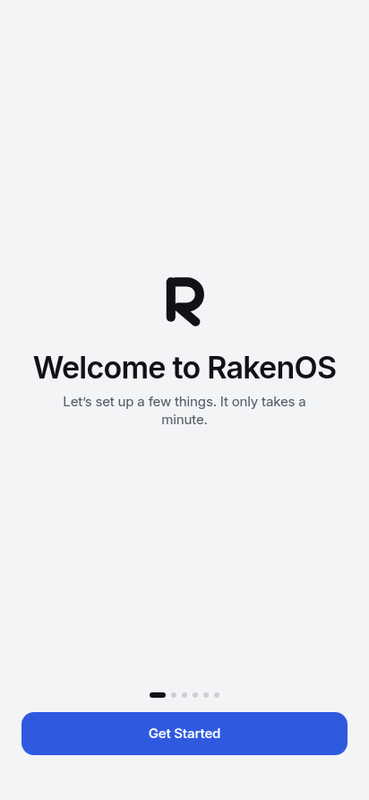 | 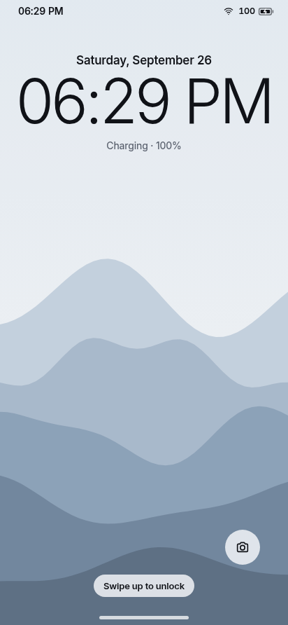 | 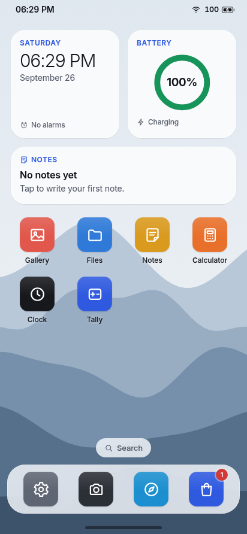 | 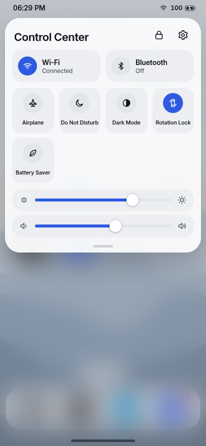 |
| 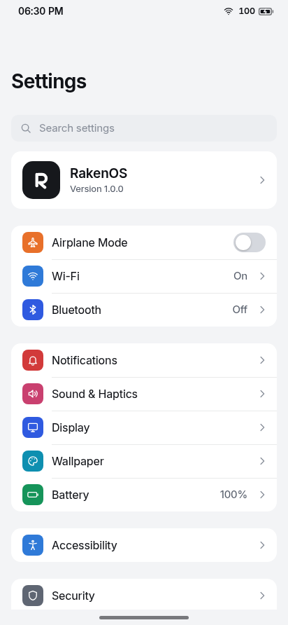 | 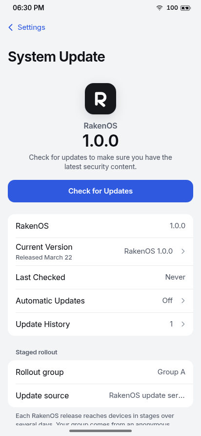 | 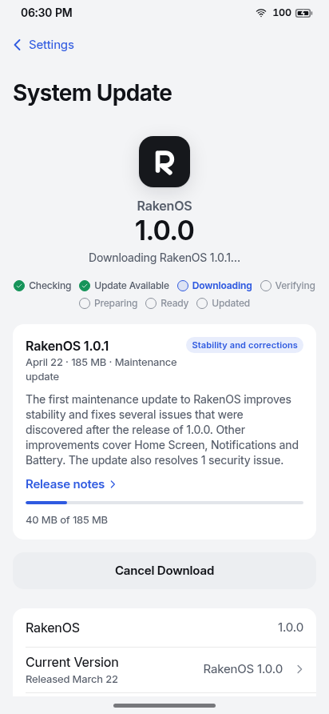 | 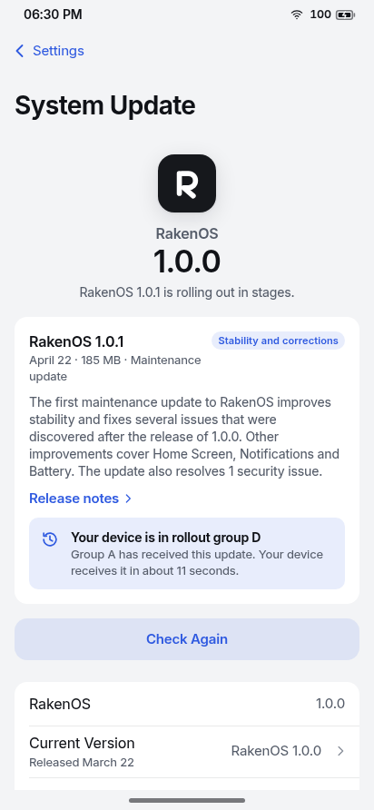 |
| 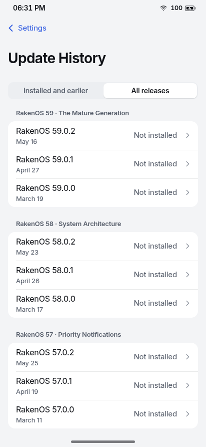 | 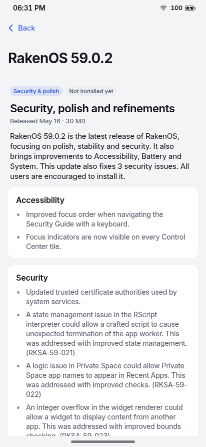 | 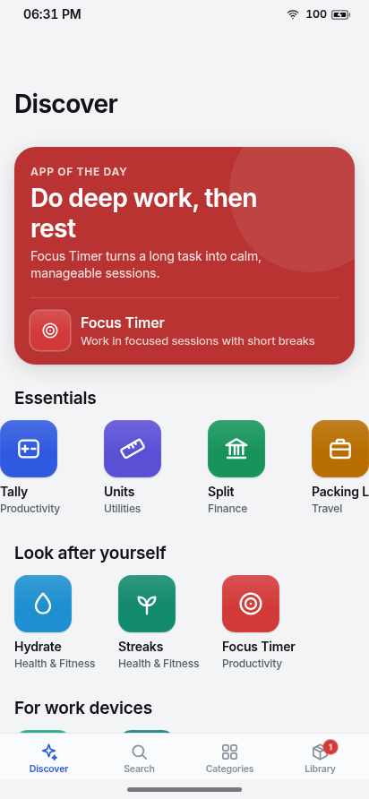 | 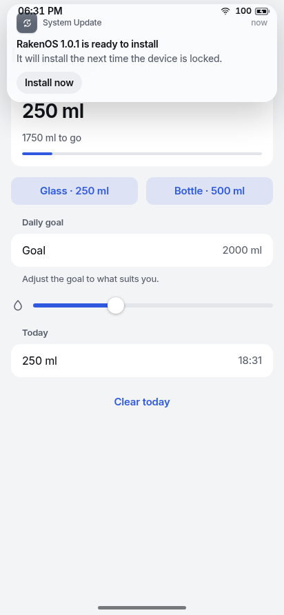 |

## Notes

- The APK in `dist/` is debug-signed. Release builds need your own keystore (see above).
- If Maven Central rate-limits Gradle, set `RAKENOS_MAVEN_MIRROR` (for example `https://maven-central.storage-download.googleapis.com/maven2/`) before `npm run build:apk`.
- `tools/keys/raken-samples.private.jwk.json` is a development key for the bundled sample apps only; never use it to sign real apps.
- RakenOS's interface and release notes are in English.
